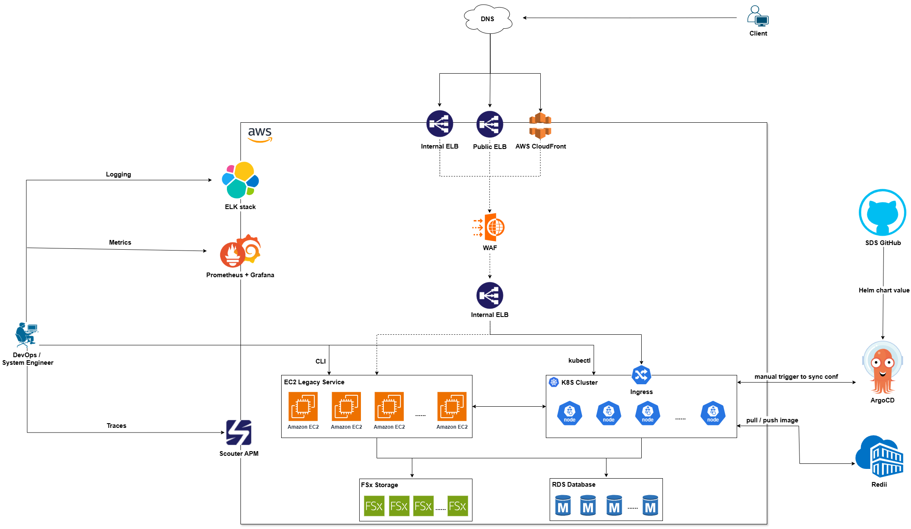
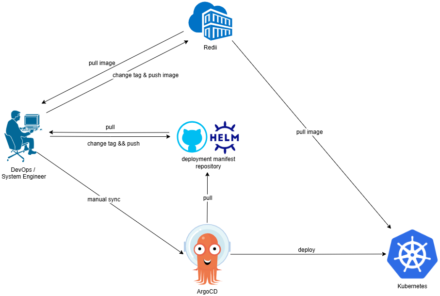
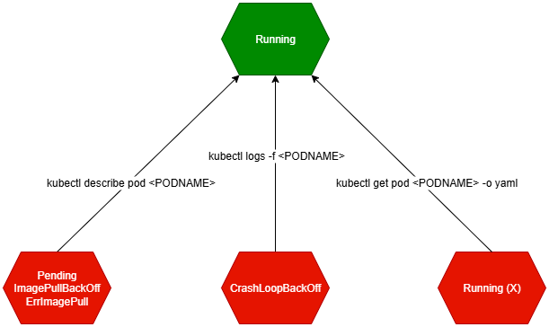

# 1. Middleware BrityMail Architecture

Domain từ DNS sẽ được trỏ về 1 trong 3 lựa chọn bên dưới:
- Trỏ về CloudFront của AWS: lựa chọn này thường được sử dụng cho các domain của khách hàng như: solu-m.brityworks.com, ... Các domain này thường sẽ đi qua WAF => Internal ELB rồi cuối cùng là vào Ingress của K8S.
- Trỏ về Public ELB: lựa chọn này thường được dùng cho các domain nội bộ như: monitor.brityworks.com, ... Các domain này từ Public ELB sẽ đi luôn vào các service phía sau (EC2, Ingress (K8S)).
- Trỏ về Internal ELB: proxy-portal.brityworks.com.        

Để kiểm tra domain được trỏ về đâu, các bạn có thể dùng:

- C1: `nslookup` từ terminal trên VDI.
- C2: Vào trang quản lý domain của SDS.
# 2. Deploy flow
      
# 3. Tools
## 3.1 Kubernetes
### 3.1.1 
### 3.1.2 Hướng dẫn xử lý sự cố với Pod trên K8S
        
Trong K8S, với 3 command như bên dưới các bạn có thể tìm ra hầu hết (70 - 80%) các nguyên nhân gây lỗi tới pod.
- `kubectl describe pod pod_name`: dùng lệnh này khi pod có các trạng thái Pending, Waiting, ImagePullBackOff, ErrImagePull.
- `kubectl logs pod_name`: dùng lệnh này khi pod có trạng thái CrashLookBackOff.
- `kubectl get pod pod_name -o yaml`: dùng lệnh này khi trong quá trình chạy pod bị restart.
Bạn có thể xem sơ đồ đầy đủ về cách xử lý các vấn đề liên quan tới pod ở đây.
### 3.1.3 Một số command hay sử dụng trong quá trình vận hành Middleware service trên K8S.
- Kiểm tra resource của các container
- Thay đổi số lượng pod của các service
    - Với các service không có HPA (sửa trực tiếp `replica` ở deployment hoặc `statefullset`)
    - Với các service sử dụng HPA (bắt buộc phải sửa ở HPA)
- Restart toàn bộ các pod (thường sử dụng trong các đợt PM Work)
- Tắt toàn bộ các pod (thường sử dụng khi cần ngắt hết kết nối (có thể là vào DB))
- Delete pod khi pod stuck ở `Terminating` status.
    ```
    kubectl delete pod <PODNAME> --grace-period=0 --force --namespace <NAMESPACE>
    ```
    Khi sử dụng command này, bạn sẽ nhận được Warning như bên dưới    
    `warning: Immediate deletion does not wait for confirmation that the running resource has been terminated. The resource may continue to run on the cluster indefinitely.`    
    Pod sẽ bị xóa ở tầng K8S nhưng container có thể vẫn running ở tầng container runtime. Vì vậy, cần check lại các container trên node để xóa triệt để.     


## 3.2 ArgoCD
Hướng dẫn tạo application trên ArgoCD
```
apiVersion: argoproj.io/v1alpha1
kind: Application
metadata:
  name: application-name
  namespace: argocd
  # Add a this finalizer ONLY if you want these to cascade delete.
  finalizers:
    - resources-finalizer.argocd.argoproj.io
spec:
  project: default
  source:
    repoURL: https://gitlab.saobang.vn/nextpay1/nextpay-devops-management/argocd/cert-manager-prod-np-other.git
    targetRevision: HEAD
    path: .

    helm:
      # Release name override (defaults to application name)
      releaseName: cert-manager-prod-np-other
      # Helm values files for overriding values in the helm chart
      # The path is relative to the spec.source.path directory defined above
      valueFiles:
        - values-prod.yaml
      # Optional Helm version to template with. If omitted it will fallback to look at the 'apiVersion' in Chart.yaml
      # and decide which Helm binary to use automatically. This field can be either 'v2' or 'v3'.
      version: v3

  destination:
    server: https://10.0.22.40/k8s/clusters/c-pjhgw
    namespace: cert-manager
  # Sync policy
  syncPolicy:
    automated: # automated sync by default retries failed attempts 5 times with following delays between attempts ( 5s, 10s, 20s, 40s, 80s ); retry controlled using `retry` field.
      prune: true # Specifies if resources should be pruned during auto-syncing ( false by default ).
      selfHeal: true # Specifies if partial app sync should be executed when resources are changed only in target Kubernetes cluster and no git change detected ( false by default ).
    syncOptions: # Sync options which modifies sync behavior
      - CreateNamespace=true # Namespace Auto-Creation ensures that namespace specified as the application destination exists in the destination cluster.
    # The retry feature is available since v1.7
    retry:
      limit: 2 # number of failed sync attempt retries; unlimited number of attempts if less than 0
      backoff:
        duration: 5s # the amount to back off. Default unit is seconds, but could also be a duration (e.g. "2m", "1h")
        factor: 2 # a factor to multiply the base duration after each failed retry
        maxDuration: 3m # the maximum amount of time allowed for the backoff strategy
```