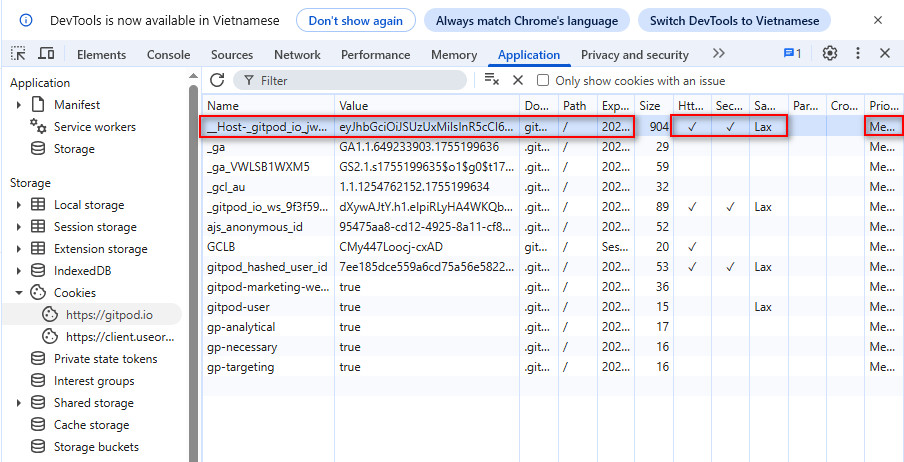

# DevTools

Tab Network để xem lỗi của API

Chi tiết lỗi thì vào Tab Console

# Import Cookie không cần tool trên Google Chrome
F12 ==> Application ==> Cookies ==> Chọn đúng domain ==> Click chuột phải vào dòng trống ==> Add new ==> Điền các thông tin cần thiết (quan trọng), phải điền đúng thì mới được ghi nhận, tốt nhất là điền theo mẫu ở một trang google đã mở sẵn (không nên điền dữ liệu cookie đã được export qua một tool).     

Ex: điền cookie của gitpod.io

`Reference:`   

