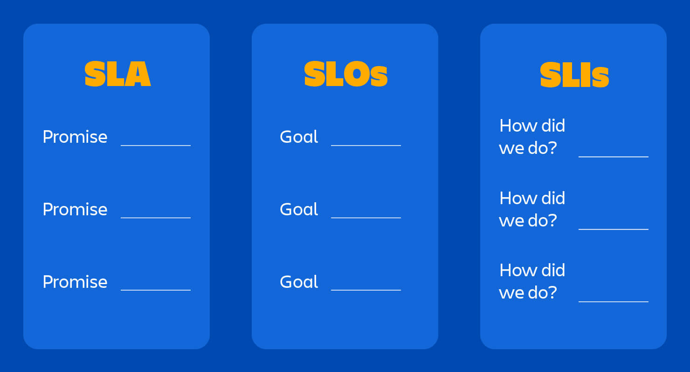

# SRE
## Define
SRE: SRE là kĩ sư phần mềm nhưng làm công việc liên quan đến operation là chính. Công việc này chiếm khoảng 50%, chủ yếu là xử lý issue, on-call. 50% còn lại tập trung phát triển tính năng cho hệ thống như auto-scaling, self-healing...     


`References:`
https://www.giaosucan.com/2020/03/chieu-binh-binh-giang-xoa-data-devops.html   

## SLA, SLO, SLI


### SLA
SLA (service level agreement) là hợp đồng pháp lý giải thích những gì đã thỏa thuận (thường là với khách hàng) và điều gì sẽ xảy ra nếu hệ thống không đáp ứng SLO.       

### SLO
SLO (service level objective) là các chỉ số mong đợi được đặt ra cho hệ thống như: Uptime/Availability, Latency, Error rate, ...

### SLI
SLI (service level indicator) là việc đo lường các chỉ số thực tế và các chỉ số thực tế đo được từ hệ thống.    



`References:`
https://newrelic.com/blog/best-practices/what-are-slos-slis-slas      
https://www.atlassian.com/incident-management/kpis/sla-vs-slo-vs-sli      


## Observability vs Monitoring
```
Cái gì bị lỗi và tại sao?
```
Monitoring trả lời cho `cái gì` và Observability trả lời cho `tại sao`.

Có sự khác biệt giữa Observability và Monitoring. Để hiểu được sự khác biệt giữa hai điều này, hãy bắt đầu bằng việc thực sự hiểu những lỗ hổng trong các hệ thống "traditional monitoring".    

Trong khi traditional monitoring cung cấp đầy đủ thông tin về cơ sở hạ tầng legacy, Observability đưa Monitoring lên `tầm cao mới`, giúp CNTT và DevOps quản lý, cung cấp và tối ưu hóa các hệ thống phức tạp.     

Để rõ ràng hơn, Observability không loại bỏ nhu cầu Monitoring. `Monitoring chỉ trở thành một trong những kỹ thuật được sử dụng để đạt được Observability.`    

Hãy nghĩ theo cách này: Observability (danh từ) là cách tiếp cận về mức độ bạn có thể hiểu hệ thống phức tạp của mình. Monitoring (động từ) là hành động bạn thực hiện để hỗ trợ cách tiếp cận đó.    


|                              | Theo dõi                                                                                             | Khả năng quan sát                                                                                                                                                  |
| ---------------------------- | ---------------------------------------------------------------------------------------------------- | ------------------------------------------------------------------------------------------------------------------------------------------------------------------ |
| Đó là gì?                    | Đo lường và báo cáo về các số liệu cụ thể trong một hệ thống để đảm bảo tình trạng tốt cho hệ thống. | Thu thập số liệu, sự kiện, bản ghi và dấu vết để cho phép điều tra sâu về các mối quan ngại đối với tình trạng trên các hệ thống phân tán có kiến trúc vi dịch vụ. |
| Trọng tâm chính              | Thu thập dữ liệu để xác định các những tác động bất thường đến hệ thống.                             | Điều tra nguyên nhân gốc rễ của những tác động bất thường đến hệ thống.                                                                                            |
| Các hệ thống có liên quan    | Thường liên quan đến các hệ thống độc lập.                                                           | Thường liên quan đến nhiều hệ thống phức tạp.                                                                                                                     |
| Khả năng truy xuất nguồn gốc | Giới hạn ở các biên của hệ thống.                                                                    | Khả dụng nếu tín hiệu được phát ra trên các kiến trúc hệ thống khác biệt.                                                                                          |
| Phát hiện lỗi hệ thống       | _Thời điểm_ và _nội dung_.                                                                           | _Lý do_ và _cách thức_.                                                                                                                                            |   


### Observability
The three pillars of observability
- Logs
- Metrics
- Traces

`References:`           
https://www.opsera.io/blog/devops-observability-what-is-it-and-how-to-implement-it     
https://newrelic.com/blog/best-practices/what-is-observability    

