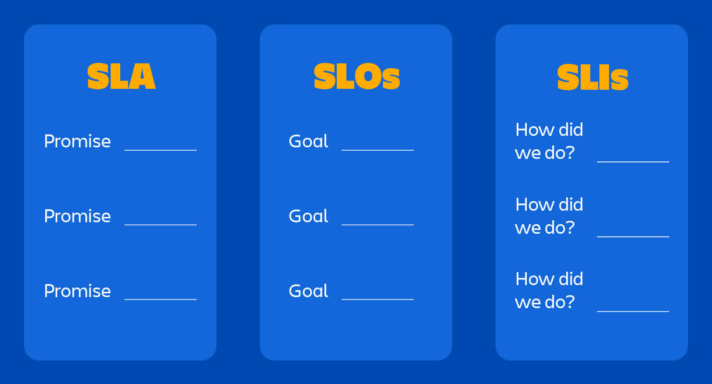

# SRE
## SLA, SLO, SLI

### SLA
SLA (service level agreement) là hợp đồng pháp lý giải thích những gì đã thỏa thuận (thường là với khách hàng) và điều gì sẽ xảy ra nếu hệ thống không đáp ứng SLO.       

### SLO
SLO (service level objective) là các chỉ số mong đợi được đặt ra cho hệ thống như: Uptime/Availability, Latency, Error rate, ...

### SLI
SLI (service level indicator) là việc đo lường các chỉ số thực tế và các chỉ số thực tế đo được từ hệ thống.    

`References:`
https://newrelic.com/blog/best-practices/what-are-slos-slis-slas      
https://www.atlassian.com/incident-management/kpis/sla-vs-slo-vs-sli      