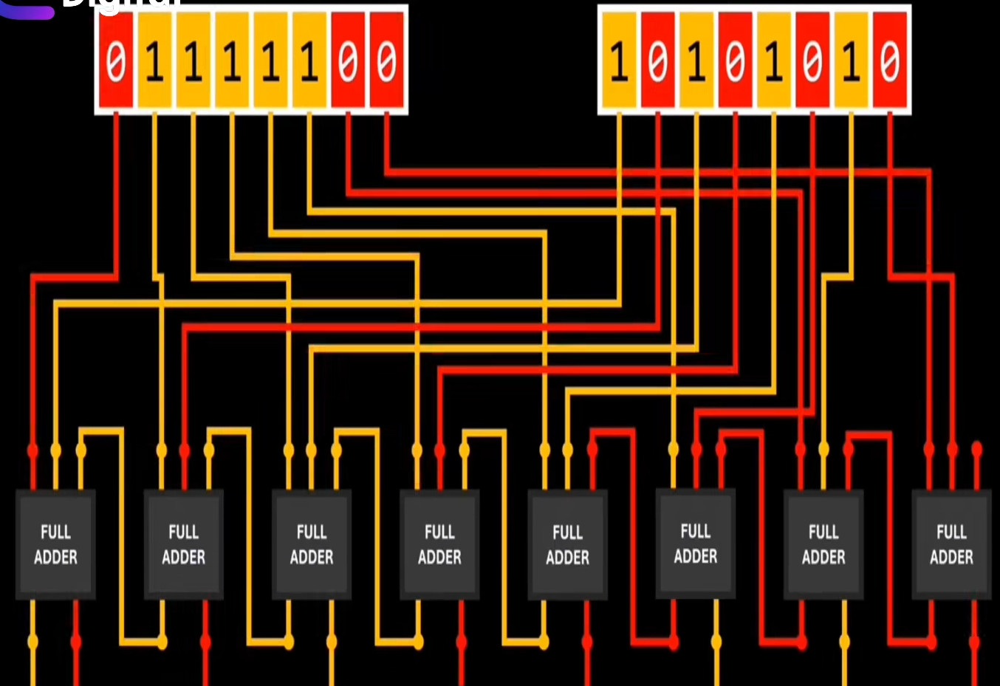
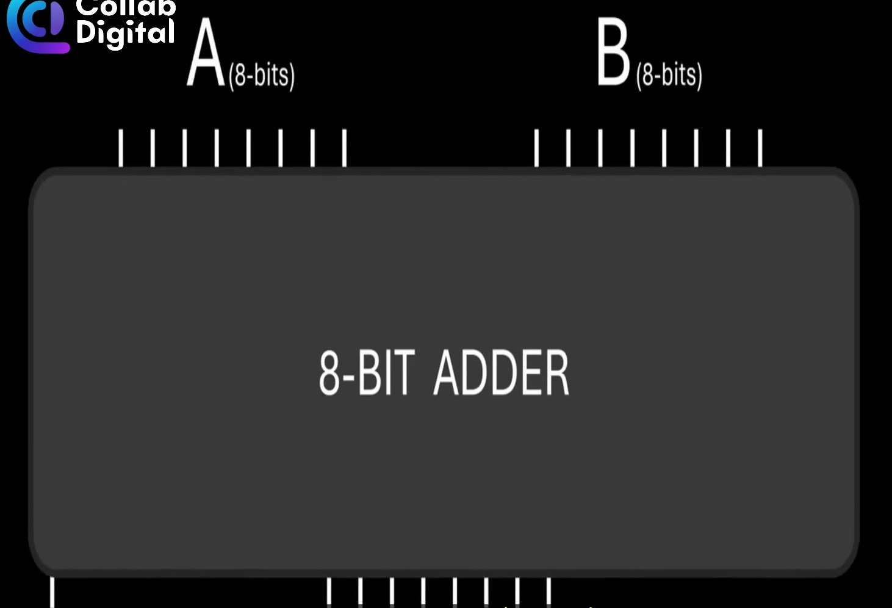
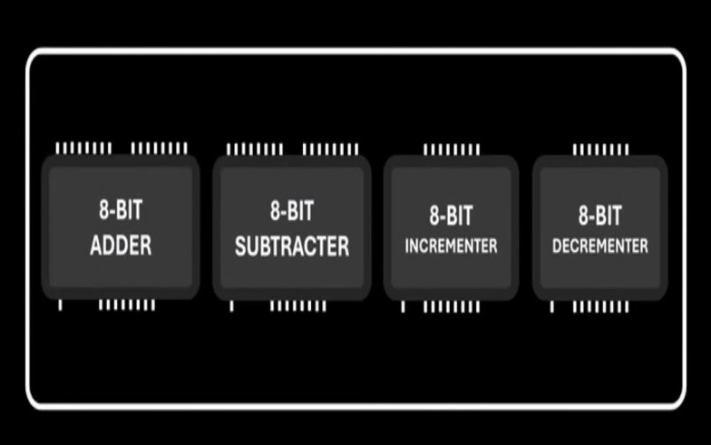

# Cách máy tính thực hiện các hoạt động

## CPU
CPU chứa hàng chục tỉ bóng bán dẫn ...

## Transistor (Bóng bán dẫn)
- `Transistor (Bóng bán dẫn)` có 2 trạng thái 1 và 0 (có dòng điện và không có dòng điện).
- Tại sao các hoạt động của máy tính quy về hệ nhị phân để thực hiện? ==> Vì dựa trên transistor và transistor thì chỉ có 2 trạng thái 0 và 1.


## Cách máy tính thực hiện phép tính dựa trên transistor

### 1. Transistor - Đơn vị cơ bản
- **Transistor** hoạt động như công tắc điện tử
- Trạng thái **ON** (có dòng điện) = 1
- Trạng thái **OFF** (không có dòng điện) = 0

### 2. Cổng logic từ transistor
#### Cổng AND
- Cần 2 transistor nối tiếp
- Chỉ cho ra 1 khi cả 2 đầu vào đều là 1

#### Cổng OR  
- Cần 2 transistor nối song song
- Cho ra 1 khi ít nhất 1 đầu vào là 1

#### Cổng NOT
- Cần 1 transistor + điện trở
- Đảo ngược tín hiệu đầu vào
- Đầu vào 0 → Đầu ra 1
- Đầu vào 1 → Đầu ra 0

#### Cổng XOR
- Kết hợp nhiều cổng AND, OR, NOT
- Cho ra 1 khi 2 đầu vào khác nhau

### 3. Máy tính thực hiện phép tính
- Vấn đề là `thiết kế các cổng logic từ transistor như thế nào` để nhận diện và thực hiện phép tính. Một số cổng transistor như Full Adder (thực hiện phép cộng), Full Subtractor (thực hiện phép trừ), ... sau đó gom các mạch tính toán này vào CPU.
Một ví dụ đơn giản là dùng cổng `XOR` để thực hiện phép tính (tất nhiên, các phép tính sẽ có nhiều trường hợp hơn và chỉ dùng cổng `XOR` thì không đủ => phải thiết kế cổng phức tạp hơn là `Full Adder`):
0 + 0 = 0
0 + 1 = 1
1 + 0 = 0
1 + 1 = 0

==> đây chính là cổng `XOR`.

#### 3.1 Ví dụ về thiết kế cho phép cộng ở CPU 8-bit
**CPU 8-bit:**
- Đặc điểm:
  - Xử lý dữ liệu 8 bit (1 byte) mỗi lần
  - Thanh ghi 8-bit
  - Bus dữ liệu 8-bit
  - Có thể địa chỉ hóa 64KB bộ nhớ (16-bit address bus)     
==> Hiểu đơn giản CPU 8-bit là con CPU chỉ làm việc được với 8bit dữ liệu là tối đa (đương nhiên 1 bit nó cũng làm), nếu nhiều hơn thì nó lại chia nhỏ ra làm nhiều gói dữ liệu 8bit để xử lí.    
- Thiết kế để cộng ở CPU 8-bit

- Cộng 2 số ở dạng 8-bit
  

  

- Tập hợp các dạng cổng logic từ các transistor vào CPU.   
  

**So sánh các CPU:**

| **CPU** | **Thanh ghi** | **Phép cộng 8-bit** | **Phép cộng 16-bit** | **Phép cộng 32-bit** | **Phép cộng 64-bit** |
|---------|---------------|---------------------|----------------------|----------------------|----------------------|
| **8-bit** | 8-bit | 1 lệnh | 2 lệnh + carry | 4 lệnh + carry | 8 lệnh + carry |
| **16-bit** | 16-bit | 1 lệnh | 1 lệnh | 2 lệnh + carry | 4 lệnh + carry |
| **32-bit** | 32-bit | 1 lệnh | 1 lệnh | 1 lệnh | 2 lệnh + carry |
| **64-bit** | 64-bit | 1 lệnh | 1 lệnh | 1 lệnh | 1 lệnh |

**Kết luận:** CPU có số bit càng cao -> thanh ghi càng lớn → Thực hiện phép tính hiệu quả hơn → Ít lệnh hơn.

## Máy tính lượng tử - Tương lai của tính toán

### **Máy tính cổ điển vs Máy tính lượng tử:**

#### **Máy tính cổ điển:**
- **Bit cổ điển**: Chỉ có 2 trạng thái 0 hoặc 1
- **Transistor**: ON/OFF rõ ràng
- **Xử lý tuần tự**: Từng bit một

#### **Máy tính lượng tử:**
- **Qubit (Quantum bit)**: Có thể ở trạng thái **superposition**
- **Trạng thái**: 0, 1, hoặc **cả 0 và 1 cùng lúc**
- **Xử lý song song**: Nhiều trạng thái cùng lúc

### **Ví dụ so sánh:**
```
Máy tính cổ điển:
- 3 bit: 000, 001, 010, 011, 100, 101, 110, 111
- Chỉ xử lý 1 trạng thái/thời điểm

Máy tính lượng tử:
- 3 qubit: Có thể xử lý tất cả 8 trạng thái cùng lúc
- Tốc độ tăng theo cấp số nhân
```

### **Ưu điểm lượng tử:**
- **Tốc độ**: Xử lý song song nhiều khả năng
- **Mã hóa**: Phá mã RSA trong thời gian ngắn
- **Mô phỏng**: Mô phỏng hệ thống phức tạp

### **Thách thức:**
- **Không ổn định**: Qubit dễ bị nhiễu
- **Nhiệt độ**: Cần làm lạnh gần 0 tuyệt đối
- **Chi phí**: Rất đắt và phức tạp

**Kết luận:** Lượng tử mở ra kỷ nguyên mới, nhưng chưa thay thế hoàn toàn máy tính cổ điển.


`Reference:`   
https://www.facebook.com/watch/?ref=saved&v=1274761980551092    